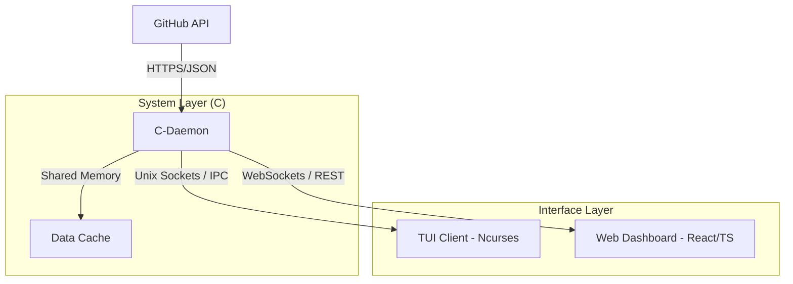

# Проект: GitFlow Dashboard (Technical Spec)

> [!IMPORTANT]
> Это комплексный проект, который объединяет системное программирование на C и современный веб-стек.

## Архитектура системы

## Технический стек и что нужно учить

### 1. C-Daemon (Ядро системы)
*   **Сетевое взаимодействие:** Библиотека `libcurl` для запросов к GitHub API.
*   **Парсинг данных:** Библиотека `cJSON` или аналоги для обработки ответов.
*   **Системные вызовы:** `fork()` для работы в фоне, обработка сигналов (SIGTERM, SIGINT).
*   **Хранение:** `mmap()` или POSIX Shared Memory для кеширования данных.
*   **Многопоточность:** `pthreads` для одновременного опроса API и обслуживания клиентов.

### 2. TUI Client (Терминал)
*   **Ncurses:** Создание окон, форм и обработка ввода в терминале.
*   **IPC:** Чтение из Shared Memory или взаимодействие через именованные каналы (FIFOs).

### 3. Web Dashboard (Визуализация)
*   **Backend для Web:** Можно использовать Node.js (с NAPI-RS для связи с демоном) или простейший прокси-сервер на C.
*   **Frontend:** React + TypeScript + Chart.js (для графиков активности).

---

## План разработки (Milestones)

1.  **MVP Daemon:** Скрипт на C, который просто делает `curl` к вашему профилю GitHub и выводит кол-во репозиториев в консоль.
2.  **Shared Memory:** Демон пишет данные в "общую память", а вторая программа (TUI) их оттуда читает.
3.  **Ncurses TUI:** Отрисовка красивой рамки и списка последних коммитов.
4.  **Networking:** Добавление Web-слоя.

---

*Этот проект — прямой путь в Senior Systems Engineer, так как он покрывает ВСЕ аспекты работы современного ПО.*
